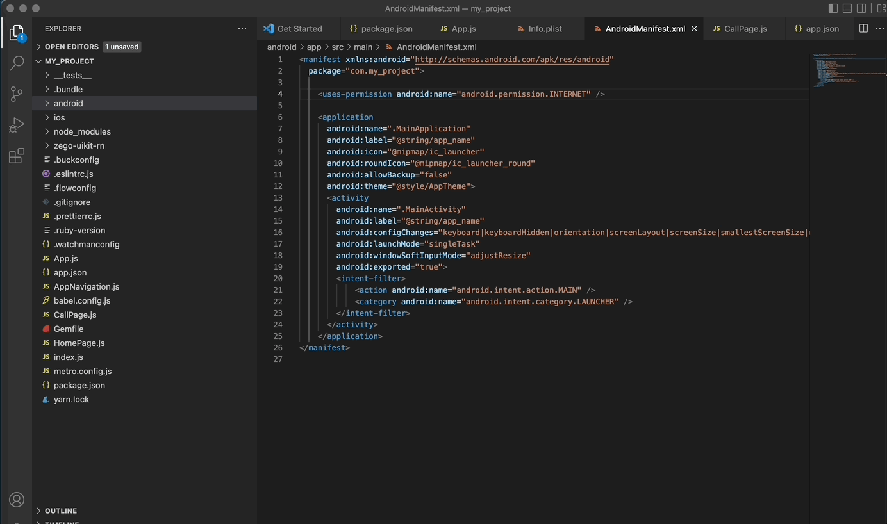

# Overview

## What is it?

`ZegoUIKitPrebuiltCall` is based on `ZegoUIKit` and makes you easily integrate the Video Call or Audio Call functionality into your App with few lines of code.


## Why you should use it?

- Fast integration
- UI Component base API
- Customizable UI

## What it has?

- Video Call and Audio Call support
- Styling Video View and Audio View
- Controlling devices
- Small View and Large View switchable
- Extendable Menu Bar

## How to integrate?

### 1. Download the `zego-uikit-rn.zip` file and extract it into your project folder.

### 2. Add `zego-uikit-rn` as dependencies to your project.
```bash
yarn add file:./zego-uikit-rn
```
### 3. Add others packages to make `zego-uikit-rn` work.
```bash
yarn add react-delegate-component zego-express-engine-reactnative
```
### 4. Using the `ZegoUIKitPrebuiltCall` widget in your project.
<pre style="background-color: #011627; border-radius: 8px; padding: 25px; color: white"><div>
// App.js
import React, { Component } from 'react';
import { ZegoUIKitPrebuiltCall } from 'zego-uikit-rn';

export default function App() {
  return (
<div style="background-color:#032A4B; margin: 0px; padding: 2px;">
    &lt;ZegoUIKitPrebuiltCall
      appID={get your app id from ZEGOCLOUD's console}
      appSign='get your app sign from ZEGOCLOUD's console'
      userID='12345' // userID should only contain numbers, English characters and  '_'. 
      userName='Oliver'
      roomID='rn12345678' // roomID should only contain numbers, English characters and  '_'. 
      config={{
        //onHangUp: () => {props.navigation.navigate('HomePage')}
      }}
    /&gt;
</div>
  );
}

</div></pre>

## How to run?

### 1. Config your project
- Android

Open `my_project/android/app/src/main/AndroidManifest.xml` file and add the code as follow:

```xml
<uses-permission android:name="android.permission.RECORD_AUDIO" />
<uses-permission android:name="android.permission.CAMERA" />
```
- iOS

Open `my_project/ios/my_project/Info.plist` file and add the code as follow:

```xml
<key>NSCameraUsageDescription</key>
<string></string>
<key>NSMicrophoneUsageDescription</key>
<string></string>
```
### 2. Build & Run

- Run on iOS device:

```bash
yarn android
```
- Run on Android device:

```bash
yarn ios
```